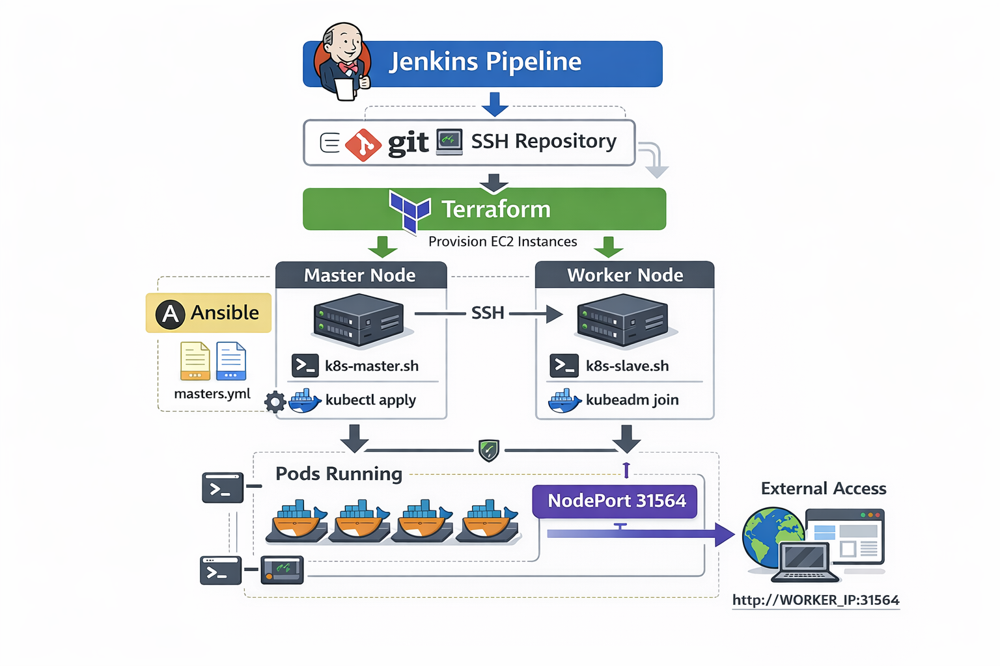
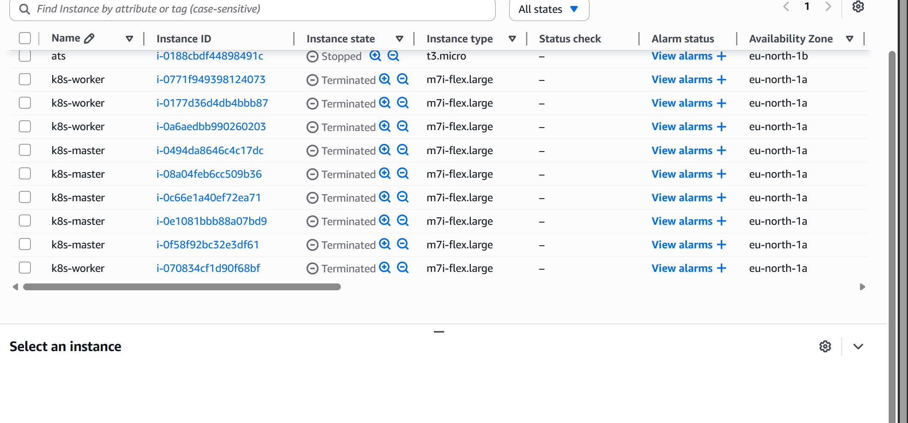
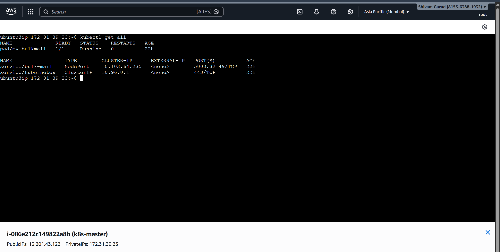

# Multi-tool-DevOps-automation-Terraform-Ansible-Jenkins-Docker-K8s


---

## 🚀 Project Overview
This project demonstrates **automated CI/CD deployment** of a web application using **Terraform, Ansible, Docker, Jenkins, and Kubernetes**.  

Key features:  
- Terraform provisions **EC2 instances** for master and worker nodes.  
- Ansible & Shell scripts configure **Docker and Kubernetes**.  
- Jenkins pipeline automates **cluster setup, pod deployment, and NodePort exposure**.  
- NodePort allows external access to your app at a **fixed port 31564**.  

---
  
### ✅ Workflow Summary:

1. **Jenkins** orchestrates the whole CI/CD pipeline.  
2. **Terraform** provisions the infrastructure (EC2 master + worker nodes).  
3. **Scripts (Ansible optional)** configure Master and Worker (kubeadm init & join).  
4. **Kubernetes cluster** is formed, and pods/services are deployed.  
5. **NodePort** exposes your app on a fixed port (`31564`) for external access.  
6. Jenkins prints a **final success message with URL** to access the app.  

---
## 🛠️ Tech Stack & Tools

| Tool / Service       | Purpose                                      |
| ------------------- | -------------------------------------------- |
| **Terraform**       | Provision EC2 instances and networking       |
| **Ansible**         | Configure Docker & Kubernetes on nodes       |
| **Docker**          | Containerize applications                    |
| **Kubernetes**      | Orchestrate pods & services                  |
| **Jenkins**         | Automate CI/CD deployment pipeline           |
| **NodePort**        | Expose web app externally via worker IP      |
# 🚀 Multi-K8s DevOps Pipeline Workflow

<p align="center">
  
  <br />
  <b>Jenkins CI/CD Pipeline Triggered</b>
</p>

<p align="center"> 🔽 </p>

<table align="center">
  <tr>
    <td align="center" width="200">
      <br/>
      <b>Infrastructure Build</b><br/>
      <code>terraform apply</code>
    </td>
    <td align="center">➡️</td>
    <td align="center" width="200">
      <br/>
      <b>Config Management</b><br/>
      <code>Wait for SSH</code>
    </td>
    <td align="center">➡️</td>
    <td align="center" width="200">
      <br/>
      <b>Cluster Init</b><br/>
      <code>kubeadm init</code>
    </td>
  </tr>
</table>

<p align="center"> 🔽 </p>

### 🛠️ Nodes Provisioning & Script Execution

| Step | Action | Command/Script |
| :--- | :--- | :--- |
| **01** | **Prepare Repository** | `git clone` + `chmod +x *.sh` |
| **02** | **Setup Master Node** | `bash k8s-master.sh` |
| **03** | **Setup Worker Node** | `bash k8s-slave.sh` |
| **04** | **Cluster Networking** | `kubeadm join` (Token Auth) |
| **05** | **Deploy Workloads** | `kubectl apply -f pod.yml` |

<p align="center"> 🔽 </p>

### 🌐 Final Architecture & Access

<table align="center">
  <tr>
    <td align="center" bgcolor="#232f3e">
      <br/>
      <font color="#ffa500"><b>Pod Running</b></font>
    </td>
    <td align="center"> ⚡ <b>NodePort: 31564</b> ⚡ </td>
    <td align="center" bgcolor="#232f3e">
      <br/>
      <font color="#ffa500"><b>App Ready</b></font>
    </td>
  </tr>
</table>

---

### 🎉 Project Status: SUCCESS
> **Shivam Garud Project** is running very well!
> - **Portfolio:** [shivam-garud.vercel.app](https://shivam-garud.vercel.app/)
> - **Live App Access:** `http://<WORKER_IP>:31564`

## 🔐 Security Group Rules
Your EC2 instances use the following **Security Group inbound rules**:

| Rule ID             | Type       | Protocol | Port Range       | Source      |
| ------------------ | ---------- | -------- | ---------------- | ----------- |
| sgr-0da334608206b0fe | Custom TCP | TCP      | 8080             | 0.0.0.0/0   |
| sgr-09e3e2bc5941b88e4 | SSH        | TCP      | 22               | 0.0.0.0/0   |
| sgr-0dcf2a037b3a1cf98 | Custom TCP | TCP      | 30000 - 32786    | 0.0.0.0/0   |
| sgr-0f10b62b784e9c21c | HTTP       | TCP      | 80               | 0.0.0.0/0   |
| sgr-082f0005565639beb | Custom TCP | TCP      | 5000             | 0.0.0.0/0   |

> ⚠️ Rules with source `0.0.0.0/0` allow access from any IP. For production, restrict to trusted IPs only.  

---

## 📦 Kubernetes Setup
- **Master Node:** Runs Kubernetes control plane.  
- **Worker Node:** Runs application pods.  
- **Pod Deployment:** YAML manifests for web apps (`node-pod.yml`, `pod.yml`).  
- **NodePort Service:** Fixed port **31564** exposes app externally.  


## 🌐 Access Your App
Once deployed, access your web app using:

http://<WORKER_NODE_IP>:31564


Example (for this pipeline run): 

---

## 🔧 Jenkins CI/CD Pipeline

- **Pipeline Features:**
  1. Terraform provisions infrastructure.  
  2. Scripts configure master & worker nodes.  
  3. Worker joins cluster automatically.  
  4. Deploys Kubernetes pods and services.  
  5. Displays success messages with project link and NodePort info.

- **Success Output Example:**

http://<WORKER_NODE_IP>:31564


## 🗂️ Project Folder Structure

```plaintext
multi-k8s-devops-project/
│-- terraform.pem ( Your PEM FILE) 
├─ terraform/
│   └─ main.tf
├─ scripts/
│   ├─ k8s-master.sh  ## autoclone from github 
│   ├─ k8s-slave.sh    
│   └─ all-update.sh
├─ k8s/
│   ├─ node-pod.yml
│   └─ pod.yml
└─ Jenkinsfile

```
 ---
👩‍🏫 **Guided and Supported by [Trupti Mane Ma’am](https://github.com/iamtruptimane)**  
---

👨‍💻 **Developed By:**  
**Shivam Garud**  
🧠 *DevOps & Cloud Enthusiast*  
💼 *Automating deployments, one pipeline at a time!*  
🌐 [GitHub Profile](https://github.com/Shivamgarud8)
🌐 [Medium blog](https://medium.com/@shivam.garud2011)
🌐 [linkedin](www.linkedin.com/in/shivam-garud)
🌐 [portfolio](https://shivam-garud.vercel.app/)

